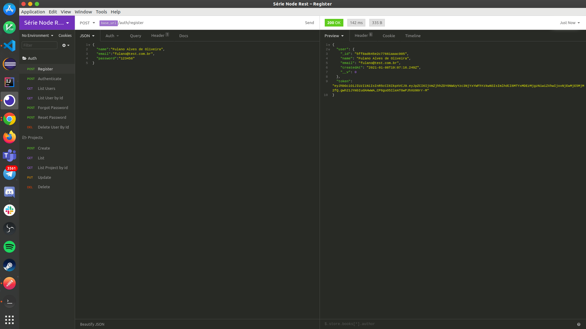
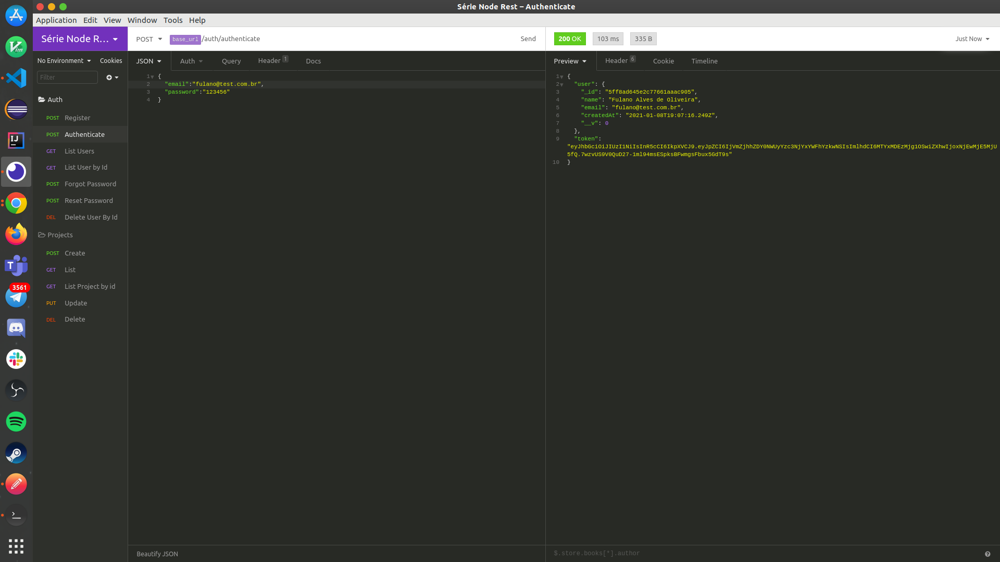
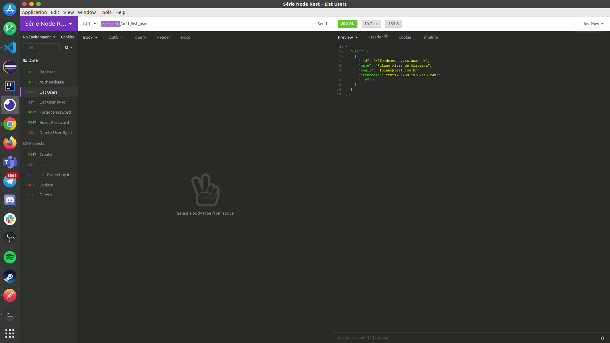
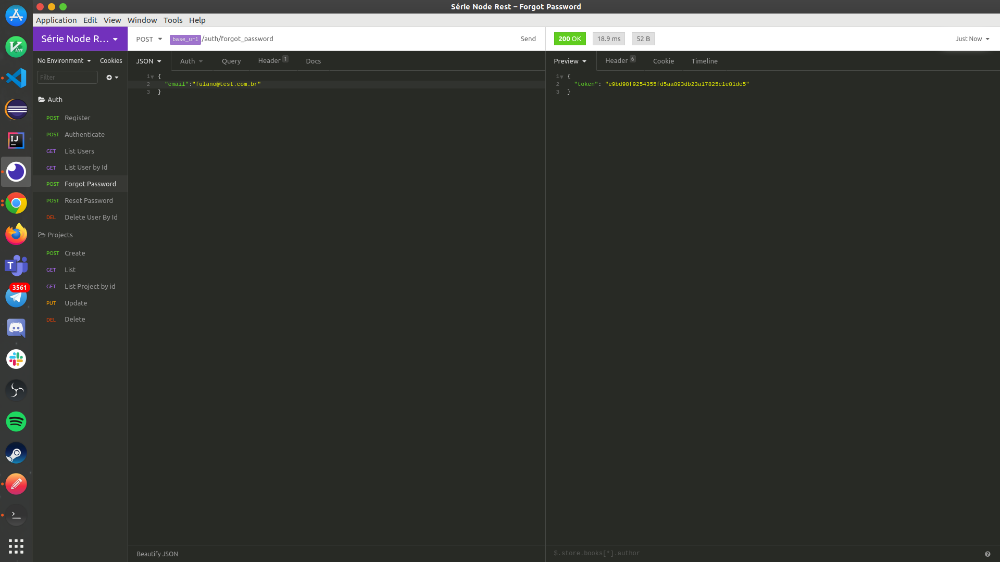
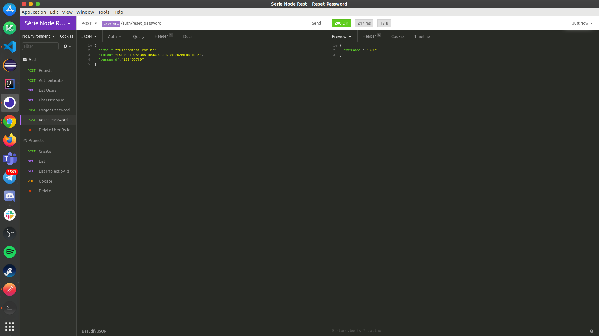
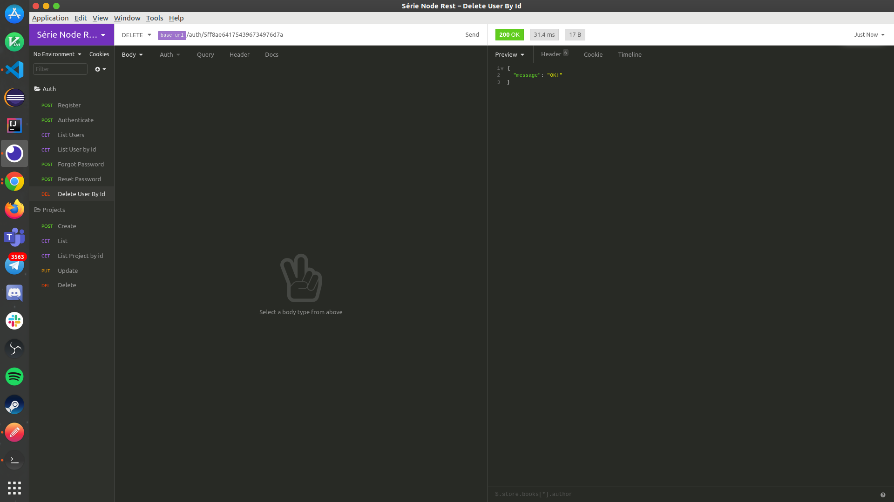

# :interrobang: Api NodeJs + Express + MongoDB
  Aplicação desenvolvida na Série Api Nodejs ministrada pelo Grupo [RocketSeat](https://rocketseat.com.br/). Feita em NodeJs, esta API conta com uma estrutura de cadastro, autentificação, recupéração de senha e CRUD relacional com MongoDB.
  
 
## :computer: Tecnologias
* **Principais**
  - **Plataforma de Aplicação JavaScript** : [Node js](https://nodejs.org/en/) que permite a criação de aplicações JavaScript para rodar de forma standalone em uma máquina, não dependendo de um browser para a execução.
  fonte: [Opus Sofware](https://www.opus-software.com.br/node-js/)
  - **Banco de Dados** : [MongoDB](https://www.mongodb.com/3) que é um banco de dados orientado a documentos no formato JSON.
  - **Gerenciador de Pacotes**: [NPM](https://www.npmjs.com/get-npm) ou [Yarn](https://classic.yarnpkg.com/en/docs/install/#debian-stable).
  - **Ferramenta para testes de Requisições**: [Insomnia](https://insomnia.rest/download/).
  
* **FrameWorks**
  - **[Express](https://expressjs.com/pt-br/)**: Responsável pelo tratamento de rotas HTTP.
  - **[Mongoose](https://mongoosejs.com/)**: Responsável por trabalhar com MongoDB dentro do NodeJs.
* **Módulos**
  - **[JsonWebToken](https://www.npmjs.com/package/jsonwebtoken)**: Responsável por trabalhar sobre os tokens de segurança.
  - **[BodyParser](https://www.npmjs.com/package/body-parser)**: Responsável por trabalhar com requisições de formatos variados, um deles é o JSON.
  - **[FS](https://www.npmjs.com/package/fs)**: Módulo pra tratar caminhos no projeto.
  - **[Path](https://www.npmjs.com/package/path)**: Módulo para trabalhar com arquivos no projeto.
  - **[NodeMailer-Express-HandleBars](https://www.npmjs.com/package/nodemailer-express-handlebars)**: Módulo para trabalhar com templates de E-mail.
* **Bibliotecas**
  - **[BcryptsJs](https://www.npmjs.com/package/bcryptjs)**: Responsável pelo trabalho de encripitação. 
* **Pacotes**
  - **[NodeMailer](https://www.npmjs.com/package/nodemailer)**: Pacotes para trabalhar com recebimento de E-mails.
  
## :collision: A Aplicação
1. **Cadastro de Usuário**
  

  
  

  
2. **Autenticação de Usuário**
  

  
  

  
3. **Listagem de Usuários**
  

  
  

  
4. **Listagem de Usuário por Id**
  

  
  

  
5. **Esqueci minha Senha**
  

  
  

  
6. **Redefinir Senha**
  

  
  

  
7. **Cadastro de Usuário**
  

  
  

  
## :warning: Execução no Sistema Linux 
> Clonar repositório da aplicação

    git clone https://github.com/victordsantoss/api-rest-nodejs.git`
> Ir até a pasta raiz do projeto 

    cd ../../api-rest-nodejs
> Instalar o Gerenciador de Pacotes do Node Js

    npm install 
> Iniciar o Servidor

    node src/index.js
